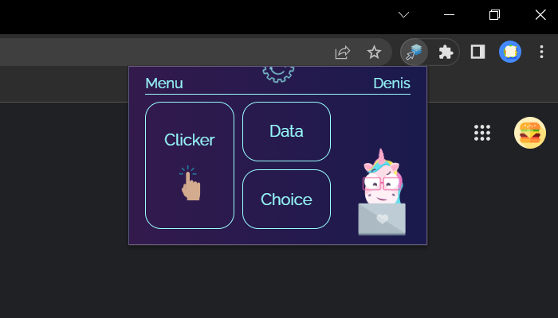
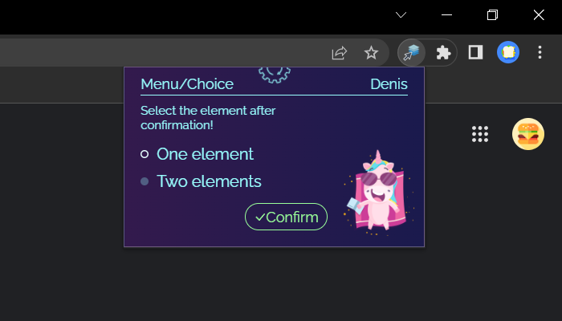
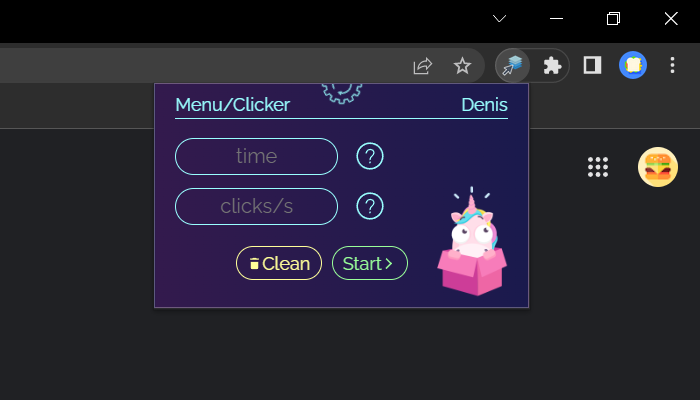
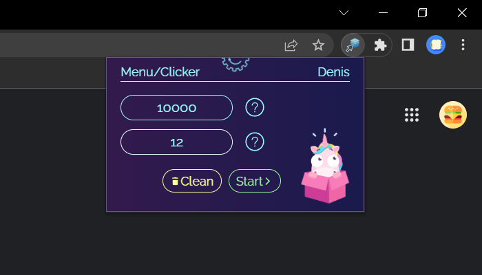
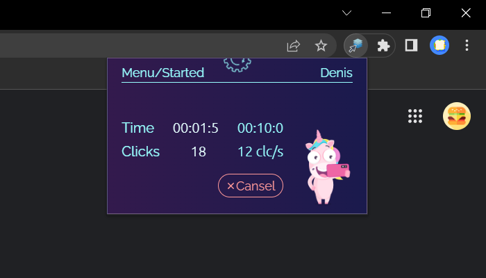

# Сlicker extension
### *Simple clicker for Google Chrome*

Clicker is a simple extension **just for fun** 😉. You can increase the number of your cookies (in a web game, not cheating), test security of certain sites or something else.

## Features👈

- Select one or two elements for clicker work 
- Specify total time and clicks per second
- Look at the dynamic stopwatch and click counter

## Tech👈

Clicker uses a number of famous projects to work properly:

- HTML, CSS, JS - basics of web
- [SASS] - preprocessor in SCSS syntax
- [VS Code] - awesome code editor
- [ReactJS], JSX - best of the best
- [NodeJS] - great packeges
- [Figma] - fascinating design

## Instructions for use👈

1. Select the option **"Choice"**.  

2. Select click mode: *one* or *two* elements. Press Confirm and click to elements on your page (**only needed**).  

3. Open extension again and select option **"Clicker"**.   

4. Input nedded total time (in ms: 10000ms = 10s) and clicks per second (in clc/s: 5clc/s = 5 clicks per second). Click **"Start"**!   

5. Have fun!   

> Happy code to you! 💛

[//]: # (Thanks Max)

   [ce]: <https://github.com/DenisCodeB/clicker-extensionr>
   [SASS]: <https://sass-lang.com/>
   [VS Code]: <https://code.visualstudio.com/>
   [NodeJS]: <http://nodejs.org>
   [ReactJS]: <https://reactjs.org>
   [Figma]: <https://www.figma.com/>
